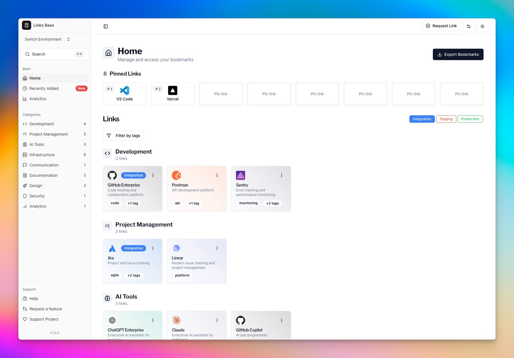

# Links Base (soon)

A modern, static link management application designed to help teams organize and access their important links efficiently. Built as a zero-cost solution that can be easily hosted on GitHub Pages, making it perfect for teams of any size.

The application excels at managing multiple environments (Production/Staging/Development) and keeps bookmarks organized through categories and tags, all while requiring no backend infrastructure or database.

Includes a powerful admin interface (accessible locally) for easy management of links, categories, tags, and settings.



## Key Benefits
- 💰 Zero hosting costs when deployed to GitHub Pages
- 🚀 No backend required - fully static application
- 🔒 Data privacy - all data stays in your repository
- 🛠 Easy to customize and maintain
- ⚡ Fast and reliable performance
- 👩‍💼 Local admin interface for managing:
  - Links and categories
  - Tags and environments
  - Application settings
  - Import/Export tools
  - Analytics and tracking

## Features
- 🌙 Dark mode support
- 🔍 Search functionality
- 🔗 Links organized by categories
- 🔖 Pin favorite links
- 📱 Multiple environment support (Production/Staging/Development)
- 🏷️ Tag-based filtering and organization
- 📥 Import/Export functionality (CSV and Bookmarks)
- 🗄️ Archive management
- 📋 Bulk link management
- 🎨 Custom brand colors for links
- 📱 Adjustable card sizes (Compact/Default)
- 🕒 Recent links tracking

## Quick Start

Clone the repository

```bash
git clone https://github.com/thedaviddias/links-base
```

Install dependencies

```bash
pnpm install
```

Start development server

```bash
pnpm dev
```

## License

MIT © [David Dias](https://github.com/thedaviddias)
